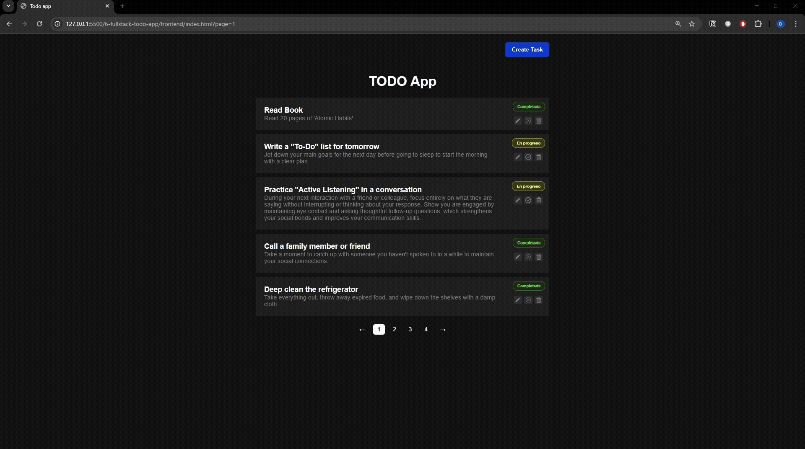

# 🚀 Fullstack TODO App (Node.js + Vanilla JS)

A fullstack task management application built entirely with Node.js (no frameworks) and Vanilla JavaScript.

This project demonstrates how to build a complete web application from scratch, including a custom backend, a modular frontend, and real-world features like pagination, state management, and URL synchronization.

The main goal is to deeply understand how modern web applications work under the hood, without relying on frameworks like Express or React.

## 🧠 Key Highlights
* Fullstack architecture (frontend + backend)
* Backend built with native Node.js modules only
* Frontend built with Vanilla JS + ES Modules
* Clean separation of concerns across layers
* Real pagination (backend-driven)
* URL state synchronization (?page=2)
* Modular and scalable code structure

## 🧩 Features

### 📌 Task Management

* Create tasks
* Edit tasks
* Delete tasks
* Toggle task state (active / completed)

### 📄 Pagination

* Backend pagination using query params:
  * `page`
  * `limit`
* Frontend pagination UI:
  * Dynamic page buttons
  * Previous / Next navigation
* URL synchronization:
  * `/ ?page=2`
* Browser history support (popstate)

### 🎨 Frontend

* Built with HTML, CSS, and Vanilla JS
* Modular architecture (ES Modules)
* Dynamic DOM rendering
* Modal system (create & edit)
* Global state management
* LocalStorage usage for UI state

### ⚙️ Backend

* Custom HTTP server (no Express)
* Manual routing system
* Controller-Service architecture
* File-based persistence (.json)
* Custom middleware (body parser)
* Clean separation of concerns

## 🚧 Notes

* This project is educational, not production-ready
* No external libraries or frameworks are used
* Focus is on understanding core concepts deeply